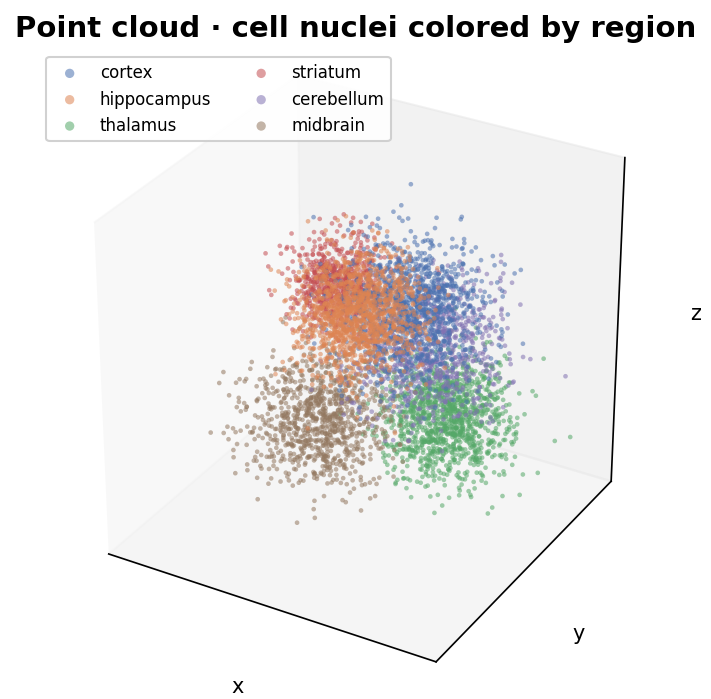
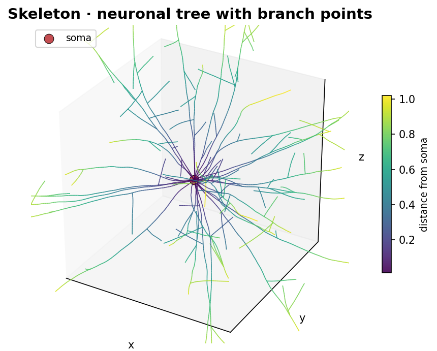
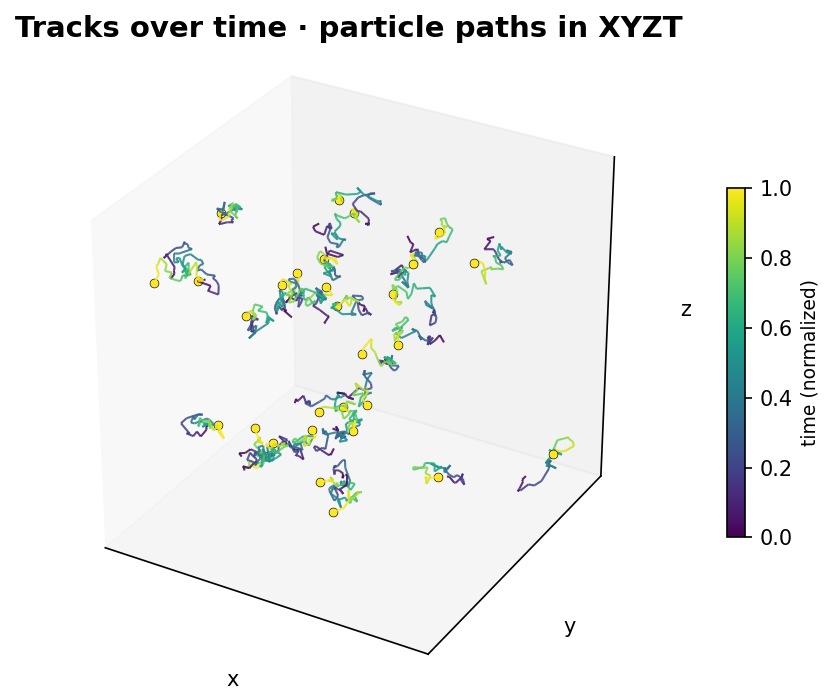
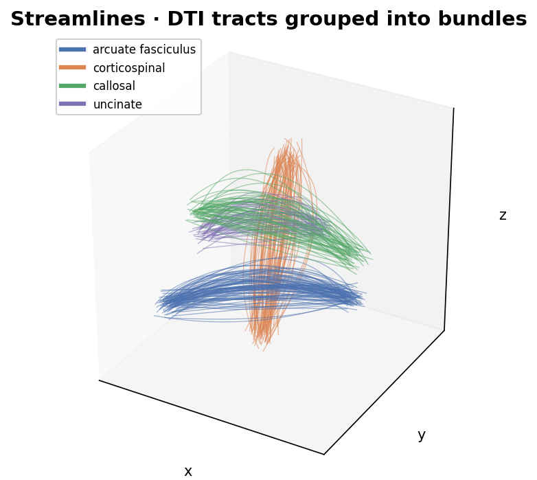

# 14. Examples

This section gives concrete store layouts and use-case details for
the data model.  Directory trees show the Zarr v3 group/array
structure; chunk keys follow the spatial chunk grid (`<i.j.k>` for
3-D, `<i.j>` for 2-D, etc.).  Metadata snippets show the on-disk
`zarr.json` content under the `"zarr_vectors"` / `"zarr_vectors_level"`
namespaces; standard Zarr v3 fields (`shape`, `chunk_grid`, `codecs`,
…) are omitted for brevity.

These examples are **format-only** — they describe what a writer
would emit on disk.  Language bindings for reading/writing each
layout live in the zarr-vectors-py package (`write_points`,
`write_mesh`, …) and are out of scope for this chapter.

---

## 14.1 Mouse Brain Nuclei: Point Cloud with Multi-Resolution and Regions



**Use case**: Single-cell positions from a cleared mouse brain (cell
nuclei centroids).  Each nucleus is an object with a volume
attribute.  Nuclei are grouped by brain region.  Multi-resolution
supports coarse-to-fine visualization.

**Directory structure**:

```
mouse_brain_nuclei.zarr/
├── zarr.json                              # root: zarr_vectors + multiscales
├── 0/
│   ├── zarr.json                          # zarr_vectors_level
│   ├── vertices/
│   │   ├── zarr.json
│   │   ├── 0.0.0
│   │   ├── 0.0.1
│   │   └── …
│   ├── vertex_fragments/
│   │   ├── zarr.json                      # zv_array = "vertex_fragments"
│   │   ├── 0.0.0
│   │   └── …
│   ├── vertex_attributes/
│   │   └── volume/
│   │       ├── zarr.json                  # µm³ per nucleus
│   │       ├── 0.0.0
│   │       └── …
│   ├── object_index/
│   │   ├── zarr.json
│   │   └── data                           # one manifest per nucleus
│   ├── groups/
│   │   ├── zarr.json
│   │   └── data                           # G regions → object id lists
│   └── group_attributes/
│       └── region_name/
│           ├── zarr.json
│           └── data                       # (G,) — "cortex", "hippocampus", …
├── 1/                                     # coarser pyramid level
│   ├── zarr.json                          # may carry bin_shape and/or chunk_shape
│   ├── vertices/
│   ├── vertex_fragments/
│   ├── vertex_attributes/
│   │   └── volume/
│   ├── object_index/                      # preserves_object_ids = true
│   ├── groups/                            # same membership, same OID space
│   └── group_attributes/
│       └── region_name/
└── 2/
    └── …                                  # further downsampled for coarse preview
```

**Root metadata** (`zarr.json["zarr_vectors"]`):

```jsonc
{
  "zv_version": "0.7.0",
  "chunk_shape": [200.0, 200.0, 200.0],
  "bounds": [[0,0,0],[1000,1000,1000]],
  "geometry_types": ["point_cloud"],
  "links_convention": "implicit_sequential",
  "object_index_convention": "standard",
  "cross_chunk_strategy": "explicit_links",
  "cross_level_storage": "explicit",
  "cross_level_depth": 1,
  "base_bin_shape": [50.0, 50.0, 50.0],
  "format_capabilities": ["fragment_index", "shared_fragments",
                          "preserved_object_ids", "multiscale_links"]
}
```

**Notes**:

- **Objects**: one nucleus per object; each nucleus is a single
  fragment (mode-0 manifest block).
- **Object index**: required (multi-chunk).  Each manifest is one
  block: `(chunk_coords, mode=0, fragment_index=k)`.
- **Vertex attributes**: `volume` (µm³) per nucleus, row-aligned to
  `vertices/<chunk>`.
- **Groups**: one entry per brain region; each carries a list of
  nucleus object IDs.
- **Group attributes**: `region_name` (string per group).
- **Multi-resolution**: per-object pyramid with coarser `bin_shape`
  at each level; coarse levels may grow `chunk_shape` (v0.7) to
  amortise overhead.  `+1` / `-1` cross-pyramid-level link arrays
  drill from fine to coarse — see §9.6.

---

## 14.2 Mesh with Multi-Resolution (v0.7 chunk-scale growth)


**Use case**: Surface mesh of a Drosophila brain compartment.
Triangular mesh, Draco-encoded vertices and faces, three resolution
levels — coarser levels grow the chunk shape so each coarse chunk
covers `2³` fine chunks.

**Directory structure**:

```
drosophila_central_complex_mesh.zarr/
├── zarr.json
├── 0/
│   ├── zarr.json                          # chunk_shape inherits root
│   ├── vertices/                          # Draco-encoded vertex chunks
│   │   ├── zarr.json                      # encoding = "draco"
│   │   ├── 0.0.0
│   │   └── …
│   ├── vertex_fragments/
│   │   ├── zarr.json
│   │   ├── 0.0.0
│   │   └── …
│   ├── links/
│   │   └── 0/                             # triangle faces (link_width = 3)
│   │       ├── zarr.json                  # link_width = 3, level_delta = 0
│   │       ├── 0.0.0
│   │       └── …
│   ├── link_fragments/
│   │   ├── zarr.json
│   │   ├── 0.0.0
│   │   └── …
│   ├── object_index/
│   │   ├── zarr.json
│   │   └── data
│   └── cross_chunk_links/
│       └── 0/                             # cross-chunk faces (link_width = 3)
│           ├── zarr.json
│           └── data
├── 1/                                     # chunk_shape = 2× root per axis
│   ├── zarr.json                          # zarr_vectors_level.chunk_shape set
│   ├── vertices/
│   ├── vertex_fragments/
│   ├── links/
│   │   ├── 0/                             # same-level faces at level 1
│   │   ├── +1/                            # OPTIONAL: fine→coarse mapping
│   │   └── -1/                            # OPTIONAL: explicit storage only
│   ├── cross_chunk_links/
│   │   ├── 0/
│   │   └── +1/
│   └── object_index/
└── 2/                                     # chunk_shape = 4× root per axis
    └── …
```

**Level-1 metadata** (`zarr.json["zarr_vectors_level"]`):

```jsonc
{
  "level": 1,
  "vertex_count": 24310,
  "arrays_present": ["vertices","vertex_fragments","links","link_fragments",
                     "object_index","cross_chunk_links"],
  "bin_shape": [400.0, 400.0, 400.0],
  "bin_ratio": [2, 2, 2],
  "chunk_shape": [400.0, 400.0, 400.0],
  "object_sparsity": 1.0,
  "coarsening_method": "manual",
  "parent_level": 0
}
```

**Notes**:

- `vertex_fragments`: each mesh "fragment" is one Draco-encoded
  per-chunk piece of the mesh; one fragment per chunk in the typical
  case.  Explicit fragments allow vertex re-use across fragments
  when meshes share rims.
- `links/0/`: triangle faces, `link_width = 3`.  `link_fragments/`
  partitions the faces by vertex fragment.
- `cross_chunk_links/0/`: triangle faces whose three vertices live
  in distinct chunks.
- **v0.7 chunk-scale growth**: level 1's chunks are `2³` × coarser
  bin-shape than level 0's, but the grids nest exactly: a level-0
  chunk `(2,3,4)` lives inside the level-1 chunk `(1,1,2)`.
- `links/+1/`, `cross_chunk_links/+1/`: optional fine→coarse mapping
  per §9.6.  A `+1` record at level 0 carries `(chunk_0, vi_0)` at
  level 0 and `(chunk_1, vi_1)` at level 1 — the chunk coords differ
  because of chunk-scale growth.

---

## 14.3 Skeleton with Cross-Chunk Objects



**Use case**: Neuronal skeletons in a large volume; each neuron is
one object that may span many spatial chunks.  Parent links
(`link_width = 1`) form a tree; most parents are sequential
(`parent = i − 1`).

**Directory structure**:

```
mouse_cortex_skeletons.zarr/
├── zarr.json                              # links_convention = "implicit_sequential_with_branches"
├── 0/
│   ├── zarr.json
│   ├── vertices/
│   │   ├── 2.1.0
│   │   ├── 2.1.1
│   │   └── …
│   ├── vertex_fragments/
│   │   ├── 2.1.0                          # one fragment per neuron piece in this chunk
│   │   └── …
│   ├── links/
│   │   └── 0/
│   │       ├── zarr.json                  # link_width = 1, branch links only
│   │       ├── 2.1.0
│   │       └── …
│   ├── link_fragments/
│   │   ├── 2.1.0
│   │   └── …
│   ├── vertex_attributes/
│   │   ├── vertex_type/
│   │   │   ├── 2.1.0
│   │   │   └── …                          # 0=soma, 1=axon, 2=dendrite
│   │   └── radius/
│   │       ├── 2.1.0
│   │       └── …                          # µm
│   ├── object_index/
│   │   └── data                           # B = number of neurons
│   └── cross_chunk_links/
│       └── 0/
│           ├── zarr.json                  # link_width = 1
│           └── data                       # parent→child crossing a chunk seam
└── 1/
    └── …                                  # per-object pyramid; preserves_object_ids
```

**Root metadata snippet**:

```jsonc
{
  "links_convention": "implicit_sequential_with_branches",
  "object_index_convention": "standard",
  "cross_chunk_strategy": "explicit_links",
  "format_capabilities": ["fragment_index","preserved_object_ids","multiscale_links"]
}
```

**Notes**:

- **Implicit-sequential-with-branches** dramatically reduces link
  storage: a 10k-vertex neuron with 50 branches stores ~50 link
  rows in `links/0/<chunk>` instead of ~10k.
- **Per-chunk fragmentation**: one fragment per neuron-piece-in-chunk.
  Neuron 42 might own fragment 3 of chunk `2.1.0` and fragment 0 of
  chunk `2.1.1`.
- **Object manifest** for neuron 42: two blocks —
  `(chunk=(2,1,0), mode=0, fragment_index=3)` and
  `(chunk=(2,1,1), mode=0, fragment_index=0)`.
- **Cross-chunk parent links**: a parent in chunk A, child in
  chunk B → one record in `cross_chunk_links/0/data` with
  endpoints `((A, parent_vi), (B, child_vi))`.

---

## 14.4 2-D Polylines with Attributes

**Use case**: Blood-vessel centerlines (polylines) in a 2-D slice
with radius and type per vertex.

**Directory structure**:

```
retina_vessels_2d.zarr/
├── zarr.json                              # sid_ndim = 2; chunk_shape = [512,512]
├── 0/
│   ├── zarr.json
│   ├── vertices/
│   │   ├── 0.0
│   │   └── …
│   ├── vertex_fragments/
│   │   ├── 0.0
│   │   └── …
│   ├── vertex_attributes/
│   │   ├── radius/
│   │   │   ├── 0.0
│   │   │   └── …                          # µm
│   │   └── vessel_type/
│   │       ├── 0.0
│   │       └── …                          # uint8: 0=artery, 1=vein, 2=capillary
│   └── object_index/
│       └── data
└── …
```

**Notes**:

- `links_convention = "implicit_sequential"` (no `links/` group at all
  unless branches exist).
- One object per vessel.  Manifest: one block per chunk the vessel
  passes through.
- Per-vertex attributes (`radius`, `vessel_type`) row-aligned to
  `vertices/<chunk>`.

---

## 14.5 Time-Series Point Cloud (XYZT)



**Use case**: Tracking spots in 3-D over time; points are `(x, y, z, t)`.

**Directory structure**:

```
cell_tracks_xyzt.zarr/
├── zarr.json                              # 4 space axes: x, y, z, t (t typed as "time")
├── 0/
│   ├── zarr.json
│   ├── vertices/
│   │   ├── 0.0.0.0                        # (x,y,z,t) chunk
│   │   ├── 0.0.0.1
│   │   └── …
│   ├── vertex_fragments/
│   │   └── …
│   └── object_index/
│       └── data                           # one object = one track across t-chunks
└── …
```

**Notes**:

- NGFF axis order is `time, channel, custom, space` — the `t` axis
  is declared first (`type = "time"`); chunk coords list `t` last
  by convention so the spatial-only chunk grid stays compact.
- Time-range queries read only the relevant `t` chunks.
- Each track's manifest lists one block per `(x,y,z,t)` chunk
  the track passes through.

---

## 14.6 Multiplexed FISH: Gene Measurements and Cell Types

**Use case**: Multiplexed FISH (MERFISH / seqFISH).  Each vertex is
a cell centroid; vertex attributes are gene counts (many channels)
and cell type; objects are cells; groups are cell-type clusters.

**Directory structure**:

```
merfish_celltype.zarr/
├── zarr.json
├── 0/
│   ├── zarr.json
│   ├── vertices/
│   │   ├── 0.0
│   │   └── …                              # cell positions (XY)
│   ├── vertex_fragments/
│   │   └── …
│   ├── vertex_attributes/
│   │   ├── gene_expression/               # multi-channel per cell
│   │   │   ├── zarr.json                  # channel_names = ["GENE0", …]
│   │   │   ├── 0.0
│   │   │   └── …
│   │   └── cell_type/
│   │       ├── 0.0
│   │       └── …                          # uint16 type id per cell
│   ├── object_index/
│   │   └── data                           # one object per cell
│   ├── groups/
│   │   └── data                           # G cell-type clusters
│   └── group_attributes/
│       ├── cell_type_name/
│       │   └── data
│       └── super_type/
│           └── data                       # e.g. "neuron", "glia"
└── …
```

**Notes**:

- **gene_expression** is stored as one multi-channel attribute (one
  blob per chunk, shape `(N_chunk, num_genes)`).  When the gene
  count is large enough that channel-axis chunking is desirable,
  the store rechunks along the gene axis using `chunk_dims =
  ["gene","dim0","dim1"]` with per-bin `chunk_attribute_values`
  (see §8.3 and the `rechunk` workflow).
- **groups** + **group_attributes/super_type**: hierarchical typing
  is expressed via group attributes, not parent-pointer structure.

---

## 14.7 Individual Gene Detections in mFISH (Spots → Cells)

**Use case**: Raw multiplexed FISH where each vertex is one
transcript spot.  Spots agglomerate into cells (objects).  Many spots
per cell.

**Directory structure**:

```
mfish_spots_cells.zarr/
├── zarr.json
├── 0/
│   ├── zarr.json
│   ├── vertices/
│   │   ├── 0.0.0
│   │   └── …                              # XYZ position per spot
│   ├── vertex_fragments/
│   │   └── …
│   ├── vertex_attributes/
│   │   ├── gene_id/                       # which transcript
│   │   ├── intensity/                     # fluorescence
│   │   └── round/                         # imaging round
│   ├── object_index/
│   │   └── data                           # one object per cell; each cell
│   │                                       # spans many fragments / chunks
│   ├── object_attributes/
│   │   ├── cell_type/
│   │   │   └── data
│   │   └── centroid/
│   │       └── data                       # (B, 3)
│   └── groups/
│       └── data                           # optional cell-type clusters
└── …
```

**Notes**:

- A cell that spans chunks gets one manifest block per chunk; within
  a chunk the spots belonging to that cell can be a range (mode 1)
  if writer ordering allowed, or an explicit list (mode 2) otherwise.
- `object_attributes/centroid/data` is `(B, 3)` — pre-computed per-cell
  summaries so a viewer can render cells without fetching every spot.

---

## 14.8 Simple DTI: Small Volume (TRX-Aligned)

**Use case**: Small DTI tractography dataset (single subject, cropped
region) where spatial chunking is unnecessary.  The store collapses
to a single spatial chunk; the layout closely aligns with the
[TRX format](https://tee-ar-ex.github.io/trx-python/stable/trx_specifications.html)
to simplify conversion and interoperability.

**TRX alignment** (mapping to zarr-vectors):

| TRX                                  | zarr-vectors                                                 |
|--------------------------------------|--------------------------------------------------------------|
| `positions` (NB_VERTICES × 3)        | `vertices` (single chunk)                                    |
| `offsets` (streamline start indices) | `vertex_fragments/<chunk>` (one fragment per streamline)     |
| `dpv` (data_per_vertex)              | `vertex_attributes/<name>/<chunk>`                           |
| `dps` (data_per_streamline)          | `object_attributes/<name>/data`                              |
| `groups` (AF_L.uint32, …)            | `groups/data` (object IDs per tract)                         |
| `dpg` (data_per_group)               | `group_attributes/<name>/data`                               |
| `header.json`                        | root `zarr.json` (axes, CRS, transforms)                     |

**Directory structure**:

```
dti_small.trx.zarr/
├── zarr.json                              # object_index_convention = "identity",
│                                           # links_convention      = "implicit_sequential"
└── 0/
    ├── zarr.json
    ├── vertices/
    │   └── 0                              # all positions in one chunk
    ├── vertex_fragments/
    │   └── 0                              # one fragment per streamline,
    │                                       # ranges = TRX offsets
    ├── vertex_attributes/
    │   ├── fa/
    │   │   └── 0
    │   └── color/
    │       └── 0                          # (NB_VERTICES, 3) uint8
    ├── object_attributes/
    │   ├── algo/
    │   │   └── data
    │   ├── clusters_QB/
    │   │   └── data
    │   └── commit_weights/
    │       └── data
    ├── groups/
    │   └── data                           # G tracts → streamline (object) ids
    └── group_attributes/
        ├── tract_name/
        │   └── data                       # AF_L, AF_R, …
        ├── mean_fa/
        │   └── data                       # (G,)
        ├── shuffle_colors/
        │   └── data                       # (G, 3)
        └── volume/
            └── data                       # (G,) uint32
```

**Notes**:

- **Single chunk**: `chunk_shape` covers the entire bounding box;
  every array has one chunk key `0` (or `0.0.0` for 3-D).
- **Identity convention**: `object_index/` omitted; object IDs
  equal fragment indices within the single chunk.
- **Implicit-sequential links**: no `links/` array.  Streamlines are
  recovered by reading the per-streamline fragment from
  `vertex_fragments/0` and walking vertex rows in order.
- **No vertex_fragments range-table optimization needed**: each
  TRX-style offset becomes one range fragment `(start, count)`.

---

## 14.9 DTI Streamlines: Large Volume with Chunking and Segment Reuse



**Use case**: Diffusion tensor imaging tractography streamlines from
a large brain volume.  Each streamline is an ordered point sequence
(no explicit links — connectivity is implicit by vertex order).
Streamlines are grouped into tracts.  **Segment reuse**: streamline
segments within a chunk are stored once and referenced by multiple
objects via shared fragments.  Pyramid levels store progressively
downsampled streamlines; coarser levels grow `chunk_shape` to keep
chunk counts tractable.

**Directory structure**:

```
dti_tracts.zarr/
├── zarr.json                              # cross_level_storage = "implicit"
├── 0/
│   ├── zarr.json
│   ├── vertices/
│   │   ├── 0.0.0
│   │   └── …                              # ordered points per segment
│   ├── vertex_fragments/
│   │   ├── 0.0.0
│   │   └── …                              # one fragment per shared segment,
│   │                                       # references via explicit indices
│   ├── object_index/
│   │   └── data                           # one object per full streamline;
│   │                                       # manifest chains segments by chunk
│   ├── object_attributes/
│   │   └── termination/
│   │       └── data                       # (B, 2): source / sink region ids
│   ├── groups/
│   │   └── data                           # G tracts → streamline IDs
│   ├── group_attributes/
│   │   └── tract_name/
│   │       └── data
│   └── cross_chunk_links/
│       └── 0/
│           └── data                       # segment-end in A → segment-start in B
├── 1/                                     # chunk_shape grows ×2 per axis
│   ├── zarr.json                          # zarr_vectors_level.chunk_shape set
│   ├── vertices/                          # fewer points per streamline
│   ├── vertex_fragments/
│   ├── links/                             # OPTIONAL fine→coarse mapping
│   │   └── +1/                            # emitted because cross_level_storage = "implicit"
│   ├── object_index/                      # preserves_object_ids = true
│   ├── object_attributes/
│   ├── groups/
│   ├── group_attributes/
│   └── cross_chunk_links/
│       ├── 0/
│       └── +1/                            # OPTIONAL: cross-chunk fine→coarse
└── 2/
    └── …
```

**Root metadata**:

```jsonc
{
  "zv_version": "0.7.0",
  "geometry_types": ["streamline"],
  "links_convention": "implicit_sequential",
  "object_index_convention": "standard",
  "cross_chunk_strategy": "explicit_links",
  "cross_level_storage": "implicit",
  "cross_level_depth": 1,
  "format_capabilities": ["fragment_index","shared_fragments",
                          "preserved_object_ids","multiscale_links"]
}
```

**Notes**:

- **Segment reuse via shared fragments**: a single fragment in chunk
  C may be referenced by many streamline manifests.  Mode-2 manifest
  blocks (explicit fragment lists) carry the ordered sequence of
  shared fragment indices that make up a streamline within that
  chunk.
- **Cross-chunk continuation**: `cross_chunk_links/0/data` records
  link the last vertex of a segment in chunk A to the first vertex
  of the next segment in chunk B (`link_width = 2`).
- **v0.7 chunk-scale growth**: level 1's `chunk_shape` is 2× root
  per axis; per-chunk fragment counts stay bounded as the pyramid
  decimates.
- **Implicit cross-level storage**: only `links/+1/` and
  `cross_chunk_links/+1/` are emitted (at the finer level).
  Coarse → fine inversion is computed at read time.

---

## 14.10 Large-Scale Distributed Write

**Use case**: Concurrent writers append skeleton fragments to the
same store (many workers tracing neurons in different tiles).

**Considerations** (same layout as 14.3):

- **Chunk-local writes are independent**: each chunk's
  `vertices/<chunk>`, `vertex_fragments/<chunk>`,
  `links/0/<chunk>`, `link_fragments/<chunk>`, and
  `vertex_attributes/<name>/<chunk>` blobs can be authored without
  coordinating fragment numbering with any other chunk.
- **Global arrays need coordination**: `object_index/data`,
  `groups/data`, and `cross_chunk_links/<delta>/data` are
  level-global byte blobs.  Writers either serialize updates or
  use a transactional backend (e.g. icechunk) that supports atomic
  multi-blob commits.
- **Capability flags**: stores that allow segment reuse advertise
  `shared_fragments`; OID-preserving pyramids built on top of these
  stores additionally advertise `preserved_object_ids`.

---

## Summary

| Example                  | sid_ndim | Objects               | links_convention             | Vertex attributes      | Groups        |
|--------------------------|----------|-----------------------|------------------------------|------------------------|---------------|
| 14.1 Mouse nuclei        | 3 (XYZ)  | nuclei                | implicit_sequential          | volume                 | region_name   |
| 14.2 Mesh pyramid (v0.7) | 3 (XYZ)  | mesh fragments        | explicit (link_width = 3)    | —                      | —             |
| 14.3 Skeletons           | 3 (XYZ)  | neurons               | implicit_sequential_with_branches | vertex_type, radius | —             |
| 14.4 Polylines           | 2 (XY)   | vessels               | implicit_sequential          | radius, vessel_type    | —             |
| 14.5 Tracks              | 4 (XYZT) | tracks                | implicit_sequential          | —                      | —             |
| 14.6 Multiplexed FISH    | 2 (XY)   | cells                 | implicit_sequential          | gene_expression, cell_type | cell_type_name, super_type |
| 14.7 mFISH spots → cells | 3 (XYZ)  | cells (many spots)    | implicit_sequential          | gene_id, intensity, round  | —         |
| 14.8 Simple DTI (TRX)    | 3 (XYZ)  | streamlines (single chunk) | implicit_sequential     | fa, color (obj: algo, clusters) | mean_fa, volume |
| 14.9 DTI streamlines (v0.7) | 3 (XYZ) | streamlines          | implicit_sequential          | — (obj: termination)   | tract_name    |
| 14.10 Distributed write  | 3 (XYZ)  | (same as 14.3)        | implicit_sequential_with_branches | —                  | —             |
