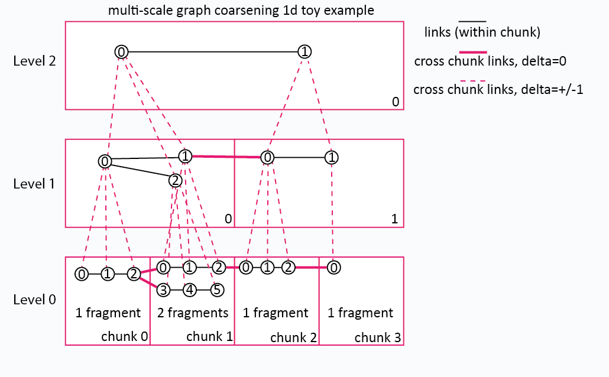

# 10. Linking Across Chunks and Levels

## 10.1 Problem Statement

Many objects span more than one spatial chunk — a neuron skeleton
that runs through six chunks, a streamline whose path crosses
several boundaries, a mesh with triangle faces straddling a seam.
Within a chunk, vertex indices are chunk-local and have no global
meaning; some additional structure must carry connectivity across
chunk boundaries.

This chapter covers **two distinct cross-chunk concepts** that the
schema treats uniformly under one array family:

- **Cross-spatial-chunk links** at one resolution level
  (`delta = 0`).  Endpoints in two different chunks at the SAME
  pyramid level — the classic "two chunks of one skeleton, with an
  edge linking them."
- **Cross-pyramid-level links** between resolution levels
  (`delta ≠ 0`).  Endpoints at the source level paired with endpoints
  at `source + delta`.  When the coarse level also grows
  `chunk_shape`, the source-side chunk coord and target-side chunk
  coord differ for the same physical region.

Both kinds live under `links/<delta>/<offsets>/` with identical record
structure; the `<delta>` path segment declares which case applies.

Connectivity is **one** array family, and **an intra-chunk link is
simply a link whose relative offsets are all zero** — see
[§10.6](#106-on-disk-layout-the-links-family).  Factoring the
relationship between endpoints into the *path* rather than into the
cell coordinate is what makes every link array an ordinary chunk-grid
array: it shards, enumerates and validates exactly like `vertices`
does, and a record never names a chunk at all.

## 10.2 Strategy 1: Boundary Deduplication

- **Principle**: vertices on chunk boundaries are duplicated into
  both adjacent chunks.  Connectivity is implicit by coordinate
  matching at read time.
- **Setting**: `cross_chunk_strategy = "boundary_deduplication"`.
- **Cost**: one extra vertex row per shared boundary point (and one
  extra fragment entry).
- **Advantages**: simplest read path — readers don't need to consult
  any cross-chunk index.
- **Disadvantages**: requires precise coordinate alignment; floating-
  point round-trips can de-align "shared" points; doesn't scale to
  cross-pyramid-level cases.

## 10.3 Strategy 2: Explicit Cross-Chunk Links



- **Principle**: each cross-chunk edge or face is written as one
  record in `links/<delta>/<offsets>/`, in the cell of its **source**
  chunk, where the `<offsets>` path segment says where the other
  endpoints sit relative to that source (see
  [§10.6](#106-on-disk-layout-the-links-family)).
- **Setting**: `cross_chunk_strategy = "explicit_links"` (the
  default).  The strategy tokens are semantic: they say how a writer
  reconciles geometry that straddles a boundary, not where the records
  are stored.
- **Record format**: see [§7.5](07-core-arrays.md#75-vertex-links).
  Each record carries `link_width` chunk-local vertex indices, one per
  endpoint.  `link_width = 2` is the generic edge; `link_width = 3` is
  a triangle face; `link_width = 1` is a single child reference (used
  by metanode drill-down).  The chunk each endpoint lives in is
  recovered from the cell coordinate plus the offsets segment — no
  chunk coords appear in the record payload.
- **Per-edge attributes** *(optional)*:
  `link_attributes/<name>/<delta>/<offsets>/` — the same offsets
  segments over the same cells, one row per record in the matching
  link cell.
- **Advantages**: explicit, no coordinate matching needed, supports
  arbitrary `link_width`, scales to cross-pyramid-level links via
  `delta ≠ 0`, and makes "all records leaving chunk A in direction d"
  a single array-cell read.

## 10.4 Strategy Selection

Stores set `cross_chunk_strategy` in root metadata; the default is
`"explicit_links"`.  The third option, `"both"`, emits both
representations — useful for stores whose readers may not all support
explicit cross-chunk links.

Picking guidance:

| Use case                                                 | Strategy                |
|----------------------------------------------------------|-------------------------|
| Skeleton with strict integer voxel-coordinate vertices   | either; deduplication is simplest |
| Streamline / polyline with float vertices                | `explicit_links`        |
| Mesh with shared rim triangles                           | `explicit_links` (link_width=3) |
| Any pyramid with chunk-scale growth                      | `explicit_links` (required for cross-pyramid records) |

## 10.5 Object Index for Cross-Chunk Objects

When an object spans chunks, its manifest in `object_index/manifests`
carries one block per chunk it touches.  Each block names one chunk and
a fragment reference (mode-0 / mode-1 / mode-2).  To reconstruct the
object, a reader:

1. Reads the object's manifest blob from `object_index/manifests` at
   row `object_id`.
2. For each block, decodes the named chunk's
   `vertex_fragments/<chunk>` to find which rows of
   `vertices/<chunk>` belong to the object.
3. Optionally reads the non-intra offsets arrays under `links/0/` at
   those chunks to recover edges bridging them.

The manifest blocks do NOT themselves carry cross-chunk *edges* — they
carry chunk + fragment references.  A manifest references vertex
fragments only.

## 10.6 On-Disk Layout: The Links Family

Connectivity is **one** array family: `links/<delta>/<offsets>/`, with
`link_attributes/<name>/<delta>/<offsets>/` mirroring it.  An
intra-chunk link is a link whose relative offsets are all zero.

### 10.6.1 Array tree

```
/<level>/links/<delta>/                              # GROUP  — family policy
/<level>/links/<delta>/<offsets>/                    # ARRAY  — one per offsets segment
/<level>/link_attributes/<name>/<delta>/             # GROUP  — mirrors the family
/<level>/link_attributes/<name>/<delta>/<offsets>/   # ARRAY  — mirrors cell-for-cell
```

Each `<offsets>` array is an ordinary per-chunk array in the sense of
[§5.2](05-zarr-store-structure.md#52-zarr-version-requirements): a
rank-`sid_ndim` vlen-bytes array over the level's chunk grid, one cell
per spatial chunk, cell files at `c/<i>/<j>/<k>`, with
`chunk_grid_origin` and `nonempty_chunks` attributes and optional
sharding.  Because the relationship between endpoints is factored into
the *path* rather than into the cell coordinate, link arrays shard and
enumerate exactly like `vertices` does.

There is no array at `links/<delta>` itself — it is always a group.

### 10.6.2 The `<delta>` segment

The signed pyramid-level delta, written `0`, `+N`, `-N`.  The leading
`+` is preserved so a directory listing distinguishes positive deltas
from the unsigned `0` at a glance.  It says how many pyramid levels the
record spans: `0` is intra-level, `±N` reaches `N` levels coarser or
finer.

### 10.6.3 The `<offsets>` segment

The offsets segment says where the record's *other* endpoints sit
**relative to its source chunk**, which is the cell that holds it.  It
carries `link_width - 1` offsets, each an `sid_ndim`-tuple of signed
integers written with the same convention as the delta; components are
joined by `.` and offsets by `_`.

| Segment | `L` | Meaning |
|---------|-----|---------|
| `0.0.0` | 2 | intra-chunk edge — both endpoints in the source chunk |
| `0.0.+1` | 2 | edge to the neighbour one chunk along `+z` |
| `0.0.-1` | 2 | edge to the neighbour one chunk along `-z` |
| `0.0.0_0.0.0` | 3 | intra-chunk triangle |
| `0.0.+1_0.+1.0` | 3 | triangle spanning the source, `+z`, and `+y` |
| `self` | 1 | `link_width == 1`; no other endpoint to locate |

The implicit `o_0` — the source chunk itself, always zero — is never
encoded.  Record component `vi_k` is a vertex row index **local to
chunk `src + o_k`**.

Directory-name invariants, which a reader MUST enforce:

1. The segment carries exactly `link_width - 1` offsets, or is the
   literal `self`.
2. Every offset has exactly `sid_ndim` components.
3. The segment is `self` **iff** `link_width == 1`.

### 10.6.4 Per-cell payload

Two encodings, selected by one condition:

| Condition | Encoding | Sidecar |
|-----------|----------|---------|
| `delta == 0` **and** offsets all zero | flat concatenated rows | `link_fragments/<chunk>` |
| otherwise | inline self-describing ragged blob | none |

The intra-chunk case is a flat row block whose per-fragment partition
lives in the sibling `link_fragments` array.  Every other array — any
non-zero offset, any `delta ≠ 0` — carries its own ragged framing
inline
(`int64 K`, then `int64 offsets[K]`, then the rows) and has no sidecar.

A row is `link_width` integer columns, or `1 + link_width` columns when
the array carries a permutation index in column 0.

### 10.6.5 Whether a permutation index is present

Endpoint order is sometimes data (a directed edge, a mesh face's
winding) and sometimes an artifact of how the writer canonicalized the
record.  `has_perm` says which, and it is stamped on every array so a
reader never has to infer it:

```python
def links_has_perm(offsets, *, delta, directed, store):
    if is_intra(offsets):     return False   # identity: nothing to canonicalise
    if delta != 0:            return False   # cross-level: source is always endpoint 0
    if store == "duplicate":  return True    # each copy leads with a different endpoint
    return not directed                      # undirected sorts; directed does not
```

So `has_perm` is true exactly when the record is non-intra **and**
`delta == 0` **and** (`store == "duplicate"` **or** not `directed`).

The canonical sort is what keeps an undirected record from being stored
twice.  Under `store = "canonical"` with `directed = false`, endpoints
are sorted by `(chunk_coords, vertex_index)` and the smallest becomes
the source — which makes **the stored offsets lexicographically
positive**, so `A→B` and `B→A` are the same cell in the same array
rather than two.  `perm_idx` is what makes that lossless: it is the
Lehmer code of the permutation, so a reader recovers the input order —
mesh-face winding, edge direction — from any stored copy.

A **negative** offsets segment therefore never arises from a canonical
undirected record.  It appears in exactly two situations: a `directed`
family, where input order is preserved verbatim and `A→B` and `B→A`
legitimately file under opposite offsets at different cells; and
`store = "duplicate"`, where the copy anchored at the larger chunk
points back at the smaller one.

The family's `directed` and `store` policy fixes what a cell contains:

| `directed` | `store` | On disk |
|------------|---------|---------|
| `false` | `canonical` | one cell, canonical-sorted, `perm_idx` present |
| `false` | `duplicate` | one copy per distinct incident chunk, `perm_idx` present |
| `true` | `canonical` | one cell in input order, no `perm_idx` |
| `true` | `duplicate` | one copy per distinct incident chunk, `perm_idx` present |

`"canonical"` stores each record once, at one source chunk.
`"duplicate"` stores one copy per distinct incident chunk, so an
incidence query on any chunk is a single cell read at the cost of a
larger store; `num_physical_records` then exceeds `num_links`.

### 10.6.6 Metadata

Family group — `links/<delta>/`:

```json
{
  "zv_array":    "links_family",
  "level_delta": 0,
  "link_width":  2,
  "directed":    false,
  "store":       "canonical",
  "sid_ndim":    3,
  "num_links":            12,
  "num_physical_records": 12
}
```

`num_links` is the **logical** record count and `num_physical_records`
the on-disk row count; both are absent until the family is finalized.
The policy lives on the group precisely because every offsets array
beneath the delta decodes against it — a conflicting re-stamp MUST be
rejected.

Offsets array — `links/<delta>/<offsets>/`:

```json
{
  "zv_array":    "links",
  "dtype":       "int64",
  "offsets":     [[0, 0, 1]],
  "has_perm":    true,
  "link_width":  2,
  "level_delta": 0
}
```

`offsets` is the parsed form of the path segment, so a reader that has
the array need not re-parse its name.

Attribute family group and array:

```json
{ "zv_array": "link_attribute_family", "name": "weight", "level_delta": 0 }
```
```json
{
  "zv_array":    "link_attribute",
  "name":        "weight",
  "dtype":       "float32",
  "row_shape":   [],
  "offsets":     [[0, 0, 1]],
  "level_delta": 0
}
```

An attribute cell is always a flat dense blob — one row per record in
the parallel link cell, in the same order — because the record
boundaries come from the link array.  There is no encoding branch.

### 10.6.7 Enumeration order

Records enumerate in **`(offsets segment, cell)` sorted order**.  Note
that `+` (`0x2b`) and `-` (`0x2d`) both sort *before* `0` (`0x30`), so
the all-zero intra-chunk segment sorts **last**:

```python
sorted(['0.0.0', '0.0.+1', '0.0.-1', '+1.0.0', '-1.0.0'])
# ['+1.0.0', '-1.0.0', '0.0.+1', '0.0.-1', '0.0.0']
#                                          ^^^^^^^ intra is LAST
```

A writer that assumes intra-chunk records come first will mis-align any
parallel array it builds by iteration order.

### 10.6.8 Validation rules

1. Every child of `links/<delta>/` is an array whose name parses as a
   valid offsets segment under the family's `link_width` and
   `sid_ndim` (§10.6.3).
2. `has_perm` on each array equals `links_has_perm(...)` computed from
   the family policy (§10.6.5).
3. Row width is `link_width + (1 if has_perm else 0)`; a cell's byte
   length is an exact multiple of one row.
4. Every `vi_k` is within the vertex count of chunk `src + o_k`, and
   that chunk exists at the endpoint's level — the owning level for
   `o_0`, `owning + delta` for the rest.
5. The intra array at `delta == 0` has a `link_fragments` cell for
   every cell it populates; no other array has one.
6. For every populated attribute cell, its row count equals the record
   count of the link cell at the same coordinate in the array with the
   same offsets segment.  A desynchronized write fails loudly at read
   time.
7. When present, `num_links` and `num_physical_records` agree with the
   records actually stored; `num_physical_records ≥ num_links`, with
   equality unless `store == "duplicate"`.

### 10.6.9 Worked examples

`sid_ndim = 3` throughout.  A record's source chunk is the cell it is
written to; the other endpoints are read off the path.

| Case | Array | Cell | Row | Reads as |
|------|-------|------|-----|----------|
| Intra-chunk edge, `L=2` | `links/0/0.0.0` | `(4,2,7)` | `[5, 2]` | vertices 5 and 2, both in chunk `(4,2,7)` |
| Edge across `+z`, `L=2` | `links/0/0.0.+1` | `(4,2,7)` | `[0, 5, 2]` | `perm_idx=0`; vertex 5 in `(4,2,7)`, vertex 2 in `(4,2,8)` |
| Edge across `-x`, `L=2`, `directed` | `links/0/-1.0.0` | `(4,2,7)` | `[5, 2]` | input order kept, no `perm_idx`; a negative offset only arises this way |
| Intra-chunk triangle, `L=3` | `links/0/0.0.0_0.0.0` | `(4,2,7)` | `[5, 3, 7]` | all three vertices in `(4,2,7)` |
| Triangle across two seams, `L=3` | `links/0/0.0.+1_0.+1.0` | `(4,2,7)` | `[0, 5, 3, 7]` | vertex 5 in `(4,2,7)`, vertex 3 in `(4,2,8)`, vertex 7 in `(4,3,7)` |
| Parent reference, `L=1` | `links/+1/self` | `(4,2,7)` | `[9]` | vertex 9 of the anchored chunk one level coarser |

Chunk identity comes from the cell coordinate plus the offsets segment;
nothing in the record names a chunk.

### 10.6.10 Reader access patterns

"Which records leave chunk `c` toward its `+z` neighbour?" is one cell
read:

```python
arr  = level["links"]["0"]["0.0.+1"]
o    = arr.attrs.get("chunk_grid_origin", (0,) * ndim)
cell = tuple(ci - oi for ci, oi in zip(c, o))
records = decode(arr[cell], link_width=L, has_perm=arr.attrs["has_perm"])
```

"Every record incident on chunk `c`, in any direction" is one cell read
per offsets segment under the delta — `list(level["links"]["0"])` names
them.  Under `store = "duplicate"` it collapses to reading chunk `c`'s
cell in every segment and taking the records verbatim, with no need to
visit the neighbours.

## 10.7 Consistency Guarantees

- **Chunk-local vertex indices.**  No record stores a global vertex
  ID.  Every `vi_k` is local to chunk `src + o_k`, and that chunk is
  recovered from the cell coordinate plus the path — so there is
  nothing to reconstruct and no global-ID space to keep consistent.
- **Attribute parity.**  `link_attributes/<name>/<delta>/<offsets>`
  mirrors `links/<delta>/<offsets>` exactly: same offsets segments,
  same cells, same per-cell row order.  Rows align 1:1 without storing
  a row id.
- **Uniform family policy.**  `link_width`, `sid_ndim`, `directed` and
  `store` are properties of the whole `<delta>` family, not of an
  individual offsets array.  A store that needs two link widths at one
  level needs two deltas, not two segments.
- **Referential integrity.**  A record naming chunk `src + o_k` obliges
  that chunk to exist and to have at least `vi_k + 1` vertices at the
  endpoint's level.  Deleting a chunk without deleting the records that
  reach into it leaves the store invalid.
- **Finalize before sharding.**  `num_links` and
  `num_physical_records` must be written before the store is sharded.
  Once cells are packed into shard files a shard's inner index is no
  longer derivable from chunk-file names, so counts that would have
  been recovered by listing cannot be.

## 10.8 Cross-Pyramid-Level Links — Optional

Records with `delta ≠ 0` connect a chunk at the owning level to chunks
at `owning + delta`.  They are emitted only when `cross_level_storage`
∈ {`implicit`, `explicit`} — see
[§9.6](09-multi-resolution-support.md#96-multiscale-link-arrays--optional).

### Offsets are measured in the target level's grid

Under `delta ≠ 0` the offsets are **not** the raw coordinate difference
between the two chunks.  They are measured against the source chunk
*re-anchored into the target level's grid*:

```
anchor = floor(c_src * r_src / r_trg)
o      = c_trg - anchor            # decode:  c_trg = anchor + o
```

where `r_src` and `r_trg` are the two levels' chunk-shape multipliers
relative to root (see [§9.3](09-multi-resolution-support.md#93-spatial-chunk-scaling)).
This matters whenever the coarse level grows `chunk_shape`: without
re-anchoring, two source chunks in the same geometric relationship to
their parent produce different raw differences, and the same physical
relationship would scatter across several offsets segments.  With it,
both produce the same offset and land in one array.

### Emission rules

- Endpoint 0 is always the source, at the owning level; endpoints
  `k > 0` are at `owning + delta`.
- Every `delta ≠ 0` array therefore has `has_perm = false`, uses the
  inline ragged encoding, and has no `link_fragments` sidecar.
- `link_width = 1` — a bare parent or child reference — writes to the
  `self` segment, whose record is a single vertex index.
- Under `cross_level_storage = "explicit"` both directions are
  materialized (`+N` at the finer level, `-N` at the coarser);
  `"implicit"` writes only the positive delta and leaves the reverse to
  be computed at read time.

### Known limitation

The `<delta>` segment is uniform across all of a record's non-source
endpoints.  A record whose endpoints sit at *different* levels — a
triangle at levels `(N, N, N+1)`, say — cannot be expressed.  Such a
record must be decomposed, or the geometry rewritten so that all
non-source endpoints share one level.
