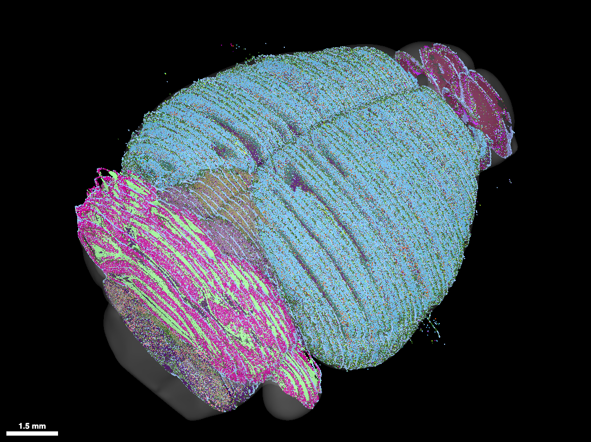
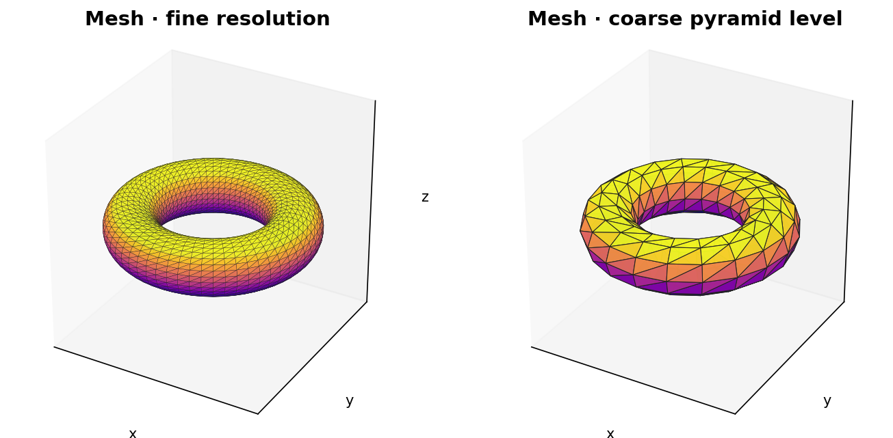

# 14. Examples

This section gives concrete store layouts and use-case details for
the data model.  Directory trees show the Zarr v3 group/array
structure; chunk keys follow the spatial chunk grid (`<i.j.k>` for
3-D, `<i.j>` for 2-D, etc.).  Metadata snippets show the on-disk
`zarr.json` content under the `"zarr_vectors"` / `"zarr_vectors_level"`
namespaces; standard Zarr v3 fields (`shape`, `chunk_grid`, `codecs`,
…) are omitted for brevity.

These examples are **format-only** — they describe what a writer
would emit on disk.  Language bindings for reading/writing each
layout live in the zarr-vectors-py package (`write_points`,
`write_mesh`, …) and are out of scope for this chapter.

---

## 14.1 Mouse Brain Nuclei: Point Cloud with Multi-Resolution and Regions



**Use case**: Single-cell positions from a cleared mouse brain (cell
nuclei centroids).  Each nucleus is an object with a volume
attribute.  Nuclei are grouped by brain region.  Multi-resolution
supports coarse-to-fine visualization.

**Directory structure**:

```
mouse_brain_nuclei.zarr/
├── zarr.json                              # root: zarr_vectors + multiscales
├── 0/
│   ├── zarr.json                          # zarr_vectors_level
│   ├── vertices/
│   │   ├── zarr.json                      # nonempty_chunks, chunk_grid_origin
│   │   └── c/
│   │       ├── 0/0/0
│   │       ├── 0/0/1
│   │       └── …
│   ├── vertex_fragments/
│   │   ├── zarr.json                      # zv_array = "vertex_fragments"
│   │   └── c/0/0/0, …
│   ├── vertex_attributes/
│   │   └── volume/
│   │       ├── zarr.json                  # µm³ per nucleus
│   │       └── c/0/0/0, …
│   ├── object_index/
│   │   ├── zarr.json                      # layout = "vlen_manifests_v1"
│   │   └── manifests                      # one manifest blob per nucleus
│   ├── groups                             # G regions → object id lists
│   └── group_attributes/
│       └── region_name                    # (G,) — "cortex", "hippocampus", …
├── 1/                                     # coarser pyramid level
│   ├── zarr.json                          # may carry bin_shape and/or chunk_shape
│   ├── vertices/
│   ├── vertex_fragments/
│   ├── vertex_attributes/
│   │   └── volume/
│   ├── object_index/                      # preserves_object_ids = true
│   ├── groups                             # same membership, same OID space
│   └── group_attributes/
│       └── region_name
└── 2/
    └── …                                  # further downsampled for coarse preview
```

**Root metadata** (`zarr.json["zarr_vectors"]`):

```json5
{
  "zv_version": "0.9.0",
  "chunk_shape": [200.0, 200.0, 200.0],
  "bounds": [[0,0,0],[1000,1000,1000]],
  "geometry_types": ["point_cloud"],
  "links_convention": "implicit_sequential",
  "object_index_convention": "standard",
  "cross_chunk_strategy": "explicit_links",
  "cross_level_storage": "explicit",
  "cross_level_depth": 1,
  "base_bin_shape": [50.0, 50.0, 50.0],
  "format_capabilities": ["fragment_index", "shared_fragments",
                          "preserved_object_ids", "multiscale_links"]
}
```

**Notes**:

- **Objects**: one nucleus per object; each nucleus is a single
  fragment (mode-0 manifest block).
- **What a *fragment* is in this example**: one nucleus inside one
  chunk.  Inside `vertex_fragments/<chunk>` it's a length-1 range
  `(start, 1)` whose `start` is the nucleus's row index in
  `vertices/<chunk>`.  The fragment count per chunk equals the
  nucleus count for that chunk.  The fragment index is what lets
  the `object_index/manifests` blob reference a nucleus by chunk-local
  position without writing global vertex IDs anywhere; it's a small
  cost (header + bitmap + range table, no CSR) and is what a reader
  uses to translate `(chunk_coords, fragment_index)` from a manifest
  block back into a row of `vertices/<chunk>`.
- **Alternative — undifferentiated point cloud**: if the store
  doesn't need per-nucleus identity (no `object_ids` at write time),
  the writer takes the per-bin path instead: each chunk's
  `vertex_fragments/<chunk>` has one fragment per bin (here
  `200/50 = 4` per axis → 64 fragments per chunk), and a fragment
  carries every nucleus that falls in that bin.  No `object_index/`
  in that case; the fragment index is purely a sub-chunk spatial
  filter.
- **Object index**: required (multi-chunk).  Each manifest is one
  block: `(chunk_coords, mode=0, fragment_index=k)`.
- **Vertex attributes**: `volume` (µm³) per nucleus, row-aligned to
  `vertices/<chunk>`.
- **Groups**: one entry per brain region; each carries a list of
  nucleus object IDs.
- **Group attributes**: `region_name` (string per group).
- **Multi-resolution**: per-object pyramid with coarser `bin_shape`
  at each level; coarse levels may grow `chunk_shape` (v0.7) to
  amortise overhead.  `+1` / `-1` cross-pyramid-level link arrays
  drill from fine to coarse — see [§9.6](09-multi-resolution-support.md#96-multiscale-link-arrays--optional).

---

## 14.2 Mesh with Multi-Resolution (v0.7 chunk-scale growth)



**Use case**: Surface mesh of a Drosophila brain compartment.
Triangular mesh, Draco-encoded vertices and faces, three resolution
levels — coarser levels grow the chunk shape so each coarse chunk
covers `2³` fine chunks.

**Directory structure**:

```
drosophila_central_complex_mesh.zarr/
├── zarr.json
├── 0/
│   ├── zarr.json                          # chunk_shape inherits root
│   ├── vertices/                          # Draco-encoded vertex cells
│   │   ├── zarr.json                      # encoding = "draco"
│   │   └── c/0/0/0, …
│   ├── vertex_fragments/
│   │   ├── zarr.json
│   │   └── c/0/0/0, …
│   ├── links/
│   │   └── 0/                             # GROUP — link_width = 3
│   │       ├── zarr.json                  # link_width = 3, directed = true
│   │       ├── 0.0.0_0.0.0/               # faces inside one chunk
│   │       │   └── c/0/0/0, …
│   │       ├── 0.0.+1_0.0.+1/             # faces straddling the +z seam
│   │       │   └── c/0/0/0, …
│   │       └── 0.0.+1_0.+1.0/             # faces spanning three chunks
│   │           └── c/0/0/0, …
│   ├── link_fragments/                    # partitions links/0/0.0.0_0.0.0 only
│   │   ├── zarr.json
│   │   └── c/0/0/0, …
│   └── object_index/
│       ├── zarr.json
│       └── manifests
├── 1/                                     # chunk_shape = 2× root per axis
│   ├── zarr.json                          # zarr_vectors_level.chunk_shape set
│   ├── vertices/
│   ├── vertex_fragments/
│   ├── links/
│   │   ├── 0/                             # same-level faces at level 1
│   │   │   └── 0.0.0_0.0.0/, 0.0.+1_0.0.+1/, …
│   │   ├── +1/                            # OPTIONAL: fine→coarse mapping
│   │   └── -1/                            # OPTIONAL: explicit storage only
│   └── object_index/
└── 2/                                     # chunk_shape = 4× root per axis
    └── …
```

**Level-1 metadata** (`zarr.json["zarr_vectors_level"]`):

```json5
{
  "level": 1,
  "vertex_count": 24310,
  "arrays_present": ["vertices","vertex_fragments","links","link_fragments",
                     "object_index"],
  "chunk_shape": [400.0, 400.0, 400.0],
  "object_sparsity": 1.0,
  "coarsening_method": "manual",
  "parent_level": 0
}
```

`bin_shape` and `bin_ratio` do **not** appear here: they live in this
level's NGFF `coordinateTransformations` entry as `translation × 2` and
`scale` respectively (see [§9.3](09-multi-resolution-support.md#93-spatial-chunk-scaling-v07)).
`arrays_present` lists family names only.

**Notes**:

- `vertex_fragments`: each mesh "fragment" is one Draco-encoded
  per-chunk piece of the mesh; one fragment per chunk in the typical
  case.  Explicit fragments allow vertex re-use across fragments
  when meshes share rims.
- `links/0/0.0.0_0.0.0/`: triangle faces wholly inside one chunk,
  `link_width = 3`.  `link_fragments` partitions those faces by vertex
  fragment.
- `links/0/0.0.+1_0.0.+1/` and friends: faces whose vertices live in
  distinct chunks.  Same family, same record shape — only the offsets
  segment differs.
- **v0.7 chunk-scale growth**: level 1's chunks are `2³` × coarser
  bin-shape than level 0's, but the grids nest exactly: a level-0
  chunk `(2,3,4)` lives inside the level-1 chunk `(1,1,2)`.
- `links/+1/`: optional fine→coarse mapping per
  [§9.6](09-multi-resolution-support.md#96-multiscale-link-arrays--optional).
  A `+1` record sits in its source chunk's cell at level 0, and its
  offsets locate the level-1 endpoint relative to that chunk
  **re-anchored into the level-1 grid** — which is what keeps
  chunk-scale growth from scattering one physical relationship across
  many offsets segments.

---

## 14.3 Skeleton with Cross-Chunk Objects


**Use case**: Neuronal skeletons in a large volume; each neuron is
one object that may span many spatial chunks.  Parent links
(`link_width = 1`) form a tree; most parents are sequential
(`parent = i − 1`).

**Directory structure**:

```
mouse_cortex_skeletons.zarr/
├── zarr.json                              # links_convention = "implicit_sequential_with_branches"
├── 0/
│   ├── zarr.json
│   ├── vertices/
│   │   ├── 2.1.0
│   │   ├── 2.1.1
│   │   └── …
│   ├── vertex_fragments/
│   │   ├── 2.1.0                          # one fragment per neuron piece in this chunk
│   │   └── …
│   ├── links/
│   │   └── 0/                             # GROUP — link_width = 2, directed = true
│   │       ├── zarr.json                  # branch links only (implicit sequential)
│   │       ├── 0.0.0/                     # parent→child inside one chunk
│   │       │   └── c/2/1/0, …
│   │       └── 0.0.+1/                    # parent→child crossing the +z seam
│   │           └── c/2/1/0, …
│   ├── link_fragments/                    # partitions links/0/0.0.0 only
│   │   └── c/2/1/0, …
│   ├── vertex_attributes/
│   │   ├── vertex_type/                   # 0=soma, 1=axon, 2=dendrite
│   │   │   └── c/2/1/0, …
│   │   └── radius/                        # µm
│   │       └── c/2/1/0, …
│   └── object_index/
│       └── manifests                      # B = number of neurons
└── 1/
    └── …                                  # per-object pyramid; preserves_object_ids
```

**Root metadata snippet**:

```json5
{
  "links_convention": "implicit_sequential_with_branches",
  "object_index_convention": "standard",
  "cross_chunk_strategy": "explicit_links",
  "format_capabilities": ["fragment_index","preserved_object_ids","multiscale_links"]
}
```

**Notes**:

- **Implicit-sequential-with-branches** dramatically reduces link
  storage: a 10k-vertex neuron with 50 branches stores ~50 link
  rows in `links/0/0.0.0` instead of ~10k.  The convention applies to
  the intra-chunk array only; a parent edge that leaves the chunk is
  always written out.
- **Per-chunk fragmentation**: one fragment per neuron-piece-in-chunk.
  Neuron 42 might own fragment 3 of chunk `2.1.0` and fragment 0 of
  chunk `2.1.1`.
- **Object manifest** for neuron 42: two blocks —
  `(chunk=(2,1,0), mode=0, fragment_index=3)` and
  `(chunk=(2,1,1), mode=0, fragment_index=0)`, read from row 42 of
  `object_index/manifests`.
- **Cross-chunk parent links**: a parent in chunk `(2,1,0)` with its
  child one step along `+z` → one record in the `links/0/0.0.+1` cell
  at `(2,1,0)`, holding `(parent_vi, child_vi)`.  The child's chunk is
  the cell plus the offset; both indices are local to their own chunk.
  Because the family sets `directed = true`, parent→child order is
  preserved verbatim and no permutation index is stored.
- **`link_width = 2`, not 1.**  A bare `link_width = 1` parent
  reference has no offsets to encode and so cannot name a second
  chunk; it is the right shape for a cross-*level* pointer, not for a
  parent edge that may cross a chunk seam.

---

## 14.4 2-D Polylines with Attributes

**Use case**: Blood-vessel centerlines (polylines) in a 2-D slice
with radius and type per vertex.

**Directory structure**:

```
retina_vessels_2d.zarr/
├── zarr.json                              # sid_ndim = 2; chunk_shape = [512,512]
├── 0/
│   ├── zarr.json
│   ├── vertices/
│   │   └── c/0/0, …
│   ├── vertex_fragments/
│   │   └── c/0/0, …
│   ├── vertex_attributes/
│   │   ├── radius/                        # µm
│   │   │   └── c/0/0, …
│   │   └── vessel_type/                   # uint8: 0=artery, 1=vein, 2=capillary
│   │       └── c/0/0, …
│   └── object_index/
│       └── manifests
└── …
```

**Notes**:

- `links_convention = "implicit_sequential"` (no `links/` group at all
  unless branches exist).
- One object per vessel.  Manifest: one block per chunk the vessel
  passes through.
- Per-vertex attributes (`radius`, `vessel_type`) row-aligned to the
  `vertices` cell at the same chunk coordinate.

---

## 14.5 Time-Series Point Cloud (XYZT)


**Use case**: Tracking spots in 3-D over time; points are `(x, y, z, t)`.

**Directory structure**:

```
cell_tracks_xyzt.zarr/
├── zarr.json                              # 4 space axes: x, y, z, t (t typed as "time")
├── 0/
│   ├── zarr.json
│   ├── vertices/                          # 4-D chunk grid
│   │   └── c/
│   │       ├── 0/0/0/0                    # (x,y,z,t) chunk
│   │       ├── 0/0/0/1
│   │       └── …
│   ├── vertex_fragments/
│   │   └── c/0/0/0/0, …
│   └── object_index/
│       └── manifests                      # one object = one track across t-chunks
└── …
```

**Notes**:

- NGFF axis order is `time, channel, custom, space` — the `t` axis
  is declared first (`type = "time"`); chunk coords list `t` last
  by convention so the spatial-only chunk grid stays compact.
- Time-range queries read only the relevant `t` chunks.
- Each track's manifest lists one block per `(x,y,z,t)` chunk
  the track passes through.

---

## 14.6 Multiplexed FISH: Gene Measurements and Cell Types

**Use case**: Multiplexed FISH (MERFISH / seqFISH).  Each vertex is
a cell centroid; vertex attributes are gene counts (many channels)
and cell type; objects are cells; groups are cell-type clusters.

**Directory structure**:

```
merfish_celltype.zarr/
├── zarr.json
├── 0/
│   ├── zarr.json
│   ├── vertices/                          # cell positions (XY)
│   │   └── c/0/0, …
│   ├── vertex_fragments/
│   │   └── c/0/0, …
│   ├── vertex_attributes/
│   │   ├── gene_expression/               # multi-channel per cell
│   │   │   ├── zarr.json                  # row_shape = [num_genes],
│   │   │   │                              #   channel_names = ["GENE0", …]
│   │   │   └── c/0/0, …
│   │   └── cell_type/                     # uint16 type id per cell
│   │       └── c/0/0, …
│   ├── object_index/
│   │   └── manifests                      # one object per cell
│   ├── groups                             # G cell-type clusters
│   └── group_attributes/
│       ├── cell_type_name
│       └── super_type                     # e.g. "neuron", "glia"
└── …
```

**Notes**:

- **gene_expression** is stored as one multi-channel attribute (one
  cell per chunk, shape `(N_chunk, num_genes)`).  `row_shape` on the
  array carries the column count, so the attribute reads back at its
  true width whether or not `channel_names` is present.  When the gene
  count is large enough that channel-axis chunking is desirable,
  the store rechunks along the gene axis using `chunk_dims =
  ["gene","dim0","dim1"]` with per-bin `chunk_attribute_values`
  (see [§8.3](08-metadata.md#83-resolution-level-metadata) and the `rechunk` workflow).
- **groups** + **group_attributes/super_type**: hierarchical typing
  is expressed via group attributes, not parent-pointer structure.

---

## 14.7 Individual Gene Detections in mFISH (Spots → Cells)

**Use case**: Raw multiplexed FISH where each vertex is one
transcript spot.  Spots agglomerate into cells (objects).  Many spots
per cell.

**Directory structure**:

```
mfish_spots_cells.zarr/
├── zarr.json
├── 0/
│   ├── zarr.json
│   ├── vertices/                          # XYZ position per spot
│   │   └── c/0/0/0, …
│   ├── vertex_fragments/
│   │   └── c/0/0/0, …
│   ├── vertex_attributes/
│   │   ├── gene_id/                       # which transcript
│   │   ├── intensity/                     # fluorescence
│   │   └── round/                         # imaging round
│   ├── object_index/
│   │   └── manifests                      # one object per cell; each cell
│   │                                       # spans many fragments / chunks
│   ├── object_attributes/
│   │   ├── cell_type                      # (B,)
│   │   └── centroid                       # (B, 3)
│   └── groups                             # optional cell-type clusters
└── …
```

**Notes**:

- A cell that spans chunks gets one manifest block per chunk; within
  a chunk the spots belonging to that cell can be a range (mode 1)
  if writer ordering allowed, or an explicit list (mode 2) otherwise.
- `object_attributes/centroid` is `(B, 3)` — pre-computed per-cell
  summaries so a viewer can render cells without fetching every spot.
  A cell with no centroid reads back as the array's `fill_value`
  (NaN here), not as a zero row.

---

## 14.8 Simple DTI: Small Volume (TRX-Aligned)

**Use case**: Small DTI tractography dataset (single subject, cropped
region) where spatial chunking is unnecessary.  The store collapses
to a single spatial chunk; the layout closely aligns with the
[TRX format](https://tee-ar-ex.github.io/trx-python/stable/trx_specifications.html)
to simplify conversion and interoperability.

**TRX alignment** (mapping to zarr-vectors):

| TRX                                  | zarr-vectors                                                 |
|--------------------------------------|--------------------------------------------------------------|
| `positions` (NB_VERTICES × 3)        | `vertices` (single chunk)                                    |
| `offsets` (streamline start indices) | `vertex_fragments/<chunk>` (one fragment per streamline)     |
| `dpv` (data_per_vertex)              | `vertex_attributes/<name>/<chunk>`                           |
| `dps` (data_per_streamline)          | `object_attributes/<name>`                                   |
| `groups` (AF_L.uint32, …)            | `groups` (object IDs per tract)                              |
| `dpg` (data_per_group)               | `group_attributes/<name>`                                    |
| `header.json`                        | root `zarr.json` (axes, CRS, transforms)                     |

**Directory structure**:

```
dti_small.trx.zarr/
├── zarr.json                              # object_index_convention = "identity",
│                                           # links_convention      = "implicit_sequential"
└── 0/
    ├── zarr.json
    ├── vertices/
    │   └── c/0/0/0                        # all positions in one cell
    ├── vertex_fragments/
    │   └── c/0/0/0                        # one fragment per streamline,
    │                                       # ranges = TRX offsets
    ├── vertex_attributes/
    │   ├── fa/
    │   │   └── c/0/0/0
    │   └── color/                         # (NB_VERTICES, 3) uint8
    │       └── c/0/0/0
    ├── object_attributes/
    │   ├── algo
    │   ├── clusters_QB
    │   └── commit_weights
    ├── groups                             # G tracts → streamline (object) ids
    └── group_attributes/
        ├── tract_name                     # AF_L, AF_R, …
        ├── mean_fa                        # (G,)
        ├── shuffle_colors                 # (G, 3)
        └── volume                         # (G,) uint32
```

**Notes**:

- **Single chunk**: `chunk_shape` covers the entire bounding box, so
  every per-chunk array has grid shape `(1, 1, 1)` and exactly one
  cell, at `c/0/0/0`.
- **Identity convention**: `object_index/` omitted; object IDs
  equal fragment indices within the single chunk.
- **Implicit-sequential links**: no `links/` group at all.
  Streamlines are recovered by reading the per-streamline fragment
  from the `vertex_fragments` cell and walking vertex rows in order.
- **No vertex_fragments range-table optimization needed**: each
  TRX-style offset becomes one range fragment `(start, count)`.

---

## 14.9 DTI Streamlines: Large Volume with Chunking and Segment Reuse


**Use case**: Diffusion tensor imaging tractography streamlines from
a large brain volume.  Each streamline is an ordered point sequence
(no explicit links — connectivity is implicit by vertex order).
Streamlines are grouped into tracts.  **Segment reuse**: streamline
segments within a chunk are stored once and referenced by multiple
objects via shared fragments.  Pyramid levels store progressively
downsampled streamlines; coarser levels grow `chunk_shape` to keep
chunk counts tractable.

**Directory structure**:

```
dti_tracts.zarr/
├── zarr.json                              # cross_level_storage = "implicit"
├── 0/
│   ├── zarr.json
│   ├── vertices/                          # ordered points per segment
│   │   └── c/0/0/0, …
│   ├── vertex_fragments/                  # one fragment per shared segment,
│   │   └── c/0/0/0, …                     #   references via explicit indices
│   ├── links/
│   │   └── 0/                             # GROUP — link_width = 2, directed
│   │       ├── 0.0.+1/                    # segment-end → next segment-start,
│   │       │   └── c/0/0/0, …             #   one array per seam direction
│   │       ├── 0.+1.0/
│   │       └── +1.0.0/
│   ├── object_index/
│   │   └── manifests                      # one object per full streamline;
│   │                                       # manifest chains segments by chunk
│   ├── object_attributes/
│   │   └── termination                    # (B, 2): source / sink region ids
│   ├── groups                             # G tracts → streamline IDs
│   └── group_attributes/
│       └── tract_name
├── 1/                                     # chunk_shape grows ×2 per axis
│   ├── zarr.json                          # zarr_vectors_level.chunk_shape set
│   ├── vertices/                          # fewer points per streamline
│   ├── vertex_fragments/
│   ├── links/
│   │   ├── 0/                             # same-level continuations
│   │   └── +1/                            # OPTIONAL fine→coarse mapping;
│   │                                       #   cross_level_storage = "implicit"
│   ├── object_index/                      # preserves_object_ids = true
│   ├── object_attributes/
│   ├── groups
│   └── group_attributes/
└── 2/
    └── …
```

**Root metadata**:

```json5
{
  "zv_version": "0.9.0",
  "geometry_types": ["streamline"],
  "links_convention": "implicit_sequential",
  "object_index_convention": "standard",
  "cross_chunk_strategy": "explicit_links",
  "cross_level_storage": "implicit",
  "cross_level_depth": 1,
  "format_capabilities": ["fragment_index","shared_fragments",
                          "preserved_object_ids","multiscale_links"]
}
```

**Notes**:

- **Segment reuse via shared fragments**: a single fragment in chunk
  C may be referenced by many streamline manifests.  Mode-2 manifest
  blocks (explicit fragment lists) carry the ordered sequence of
  shared fragment indices that make up a streamline within that
  chunk.
- **Cross-chunk continuation**: each segment-end → next-segment-start
  is one `link_width = 2` record in the `links/0/<offsets>` array for
  that seam direction, written to the source chunk's cell.  With
  `directed = true` the along-path order is preserved and no
  permutation index is stored, so a record is two chunk-local vertex
  indices and nothing else.
- **v0.7 chunk-scale growth**: level 1's `chunk_shape` is 2× root
  per axis; per-chunk fragment counts stay bounded as the pyramid
  decimates.
- **Implicit cross-level storage**: only the `links/+1/` arrays are
  emitted, at the finer level.  Coarse → fine inversion is computed at
  read time.

---

## 14.10 Large-Scale Distributed Write

**Use case**: Concurrent writers append skeleton fragments to the
same store (many workers tracing neurons in different tiles).

**Considerations** (same layout as 14.3):

- **Chunk-local writes are independent**: each chunk's cell in
  `vertices`, `vertex_fragments`, `links/0/<offsets>`,
  `link_fragments`, and `vertex_attributes/<name>` can be authored
  without coordinating fragment numbering with any other chunk.  Every
  cell is its own chunk file.
- **Presence is shared state**: `nonempty_chunks` is one attribute on
  the whole array, so independent per-cell writers must not each
  update it.  They write cells without recording presence, and a
  coordinator derives the attribute in one pass afterwards.
- **Global arrays need coordination**: `object_index/manifests` and
  `groups` are level-global.  Writers either serialize updates or use
  a transactional backend (e.g. icechunk) that supports atomic
  multi-blob commits.
- **Sharding changes the unit of contention.**  Unsharded, two writers
  touching different cells never conflict.  Sharded, the shard file is
  the unit of atomicity: writers in different shards are still
  independent, but two writers in the same shard must serialize.
- **Finalize before sharding**: link record counts must be written
  before the store is sharded, because a shard's inner index is not
  derivable from chunk-file names once the cells are packed.
- **Capability flags**: stores that allow segment reuse advertise
  `shared_fragments`; OID-preserving pyramids built on top of these
  stores additionally advertise `preserved_object_ids`.

---

## Summary

| Example                  | sid_ndim | Objects               | links_convention             | Vertex attributes      | Groups        |
|--------------------------|----------|-----------------------|------------------------------|------------------------|---------------|
| 14.1 Mouse nuclei        | 3 (XYZ)  | nuclei                | implicit_sequential          | volume                 | region_name   |
| 14.2 Mesh pyramid (v0.7) | 3 (XYZ)  | mesh fragments        | explicit (link_width = 3)    | —                      | —             |
| 14.3 Skeletons           | 3 (XYZ)  | neurons               | implicit_sequential_with_branches | vertex_type, radius | —             |
| 14.4 Polylines           | 2 (XY)   | vessels               | implicit_sequential          | radius, vessel_type    | —             |
| 14.5 Tracks              | 4 (XYZT) | tracks                | implicit_sequential          | —                      | —             |
| 14.6 Multiplexed FISH    | 2 (XY)   | cells                 | implicit_sequential          | gene_expression, cell_type | cell_type_name, super_type |
| 14.7 mFISH spots → cells | 3 (XYZ)  | cells (many spots)    | implicit_sequential          | gene_id, intensity, round  | —         |
| 14.8 Simple DTI (TRX)    | 3 (XYZ)  | streamlines (single chunk) | implicit_sequential     | fa, color (obj: algo, clusters) | mean_fa, volume |
| 14.9 DTI streamlines (v0.7) | 3 (XYZ) | streamlines          | implicit_sequential          | — (obj: termination)   | tract_name    |
| 14.10 Distributed write  | 3 (XYZ)  | (same as 14.3)        | implicit_sequential_with_branches | —                  | —             |
